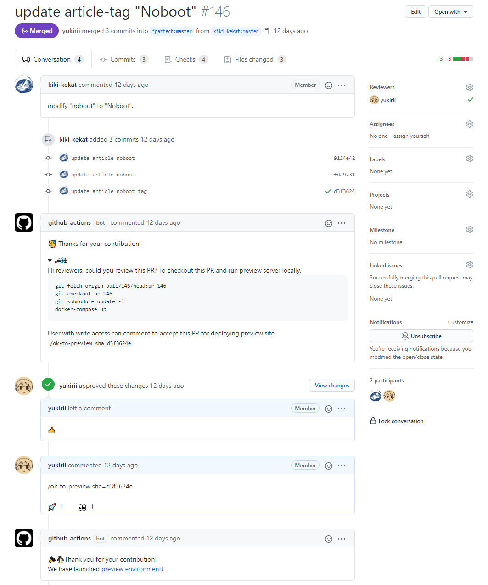
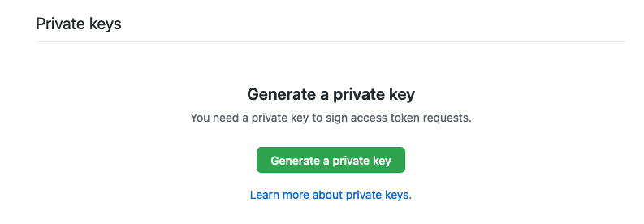
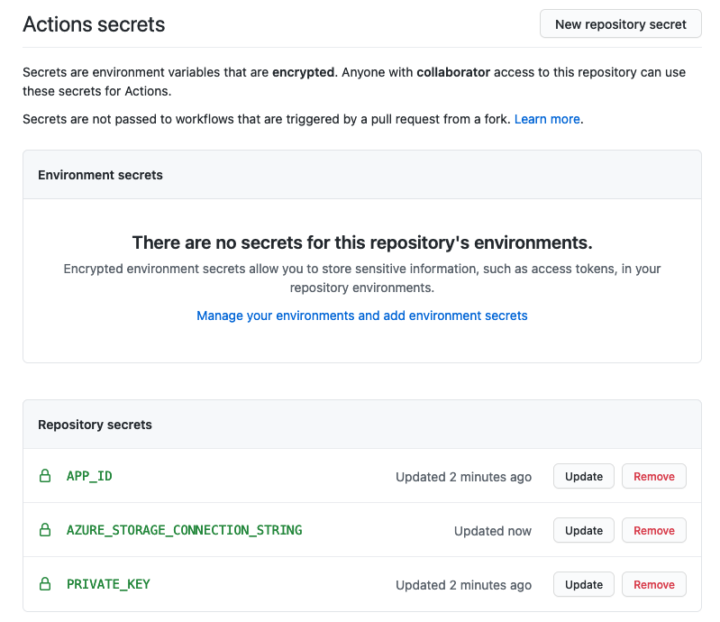

# Deploy preview site for Pull Requests

With this workflows you can deploy preview site for Pull Requests by [Prow](https://prow.k8s.io/command-help)-like slash command `/ok-to-preview sha=<commit SHA>`.
Preview sites are served from [Static website hosting in Azure Storage](https://docs.microsoft.com/en-us/azure/storage/blobs/storage-blob-static-website).
The workflow also comments to the pull request an example of the commands for preview.
Its now even easier to check build results in reviewing process before publish the changes.



## Prerequisites

* **Azure Storage Account enabled with Static Website hosting**: see [Host a static website in Azure Storage](https://docs.microsoft.com/en-us/azure/storage/blobs/storage-blob-static-website-how-to). Take note of the values for the [Website URL](https://docs.microsoft.com/en-us/azure/storage/blobs/storage-blob-static-website-how-to#find-the-website-url) and [Connection String](https://docs.microsoft.com/en-us/azure/storage/common/storage-account-keys-manage#view-account-access-keys).

* **GitHub App**: Follow the directions in the **Create GitHub App** section in this article. Take note of the values `AppID` and `private key`.

### Create GitHub App

1. Go to **Settings** for your GitHub organization. 

    `https://github.com/organizations/{YOUR ORG}/settings/profile`

2. Select **Developer settings** > **GitHub Apps**.

3. Select **New GitHub App**.

    

4. Enter **GitHub App name** and **Homepage URL**.

    

5. Remove check from Webhook **Active**.

    

6. Set repository permissions.

    * Contents: `Read & write`
    * Metadata: `Read-only`
    * Pull requests: `Read-only`

7. Select **Only on this account**. Select **Create GitHub App**.

    

8. The **AppID** appeares in the **General** page of the GitHub App.

    

9. Move to **Private keys** section. Select **Generate a private key**.

    

### Install GitHub App to your organization

1. Go to **Install App**. Select **Install**.

    

2. Enable **Only select repositories** option and select your blog repository. Select **Install**.

    

### Configure the GitHub secrets

1. Go to **Secrets** settings for your blog repository.

    `https://github.com/{YOUR ORG}/blog/settings/secrets/actions`

2. Select **New repository secret** and add following secrets:

    * `APP_ID`: App ID of created GitHub App
    * `PRIVATE_KEY`: Private key of created GitHub App
    * `AZURE_STORAGE_CONNECTION_STRING`: Connection string for Azure Blob Storage

    

## Workflows

You need to store following YAMLs in the `.github/workflows` directory of your blog repository.

**1. pull-request-target.yml**: workflow posting comment and cleaning up preview site for closed pull request.

```yaml
# File: {your-blog-repo}/.github/workflows/pull-request-target.yml

name: pull-request-target

on:
  pull_request_target:
    types: [opened, reopened, closed]

jobs:
  pr-comment:
    runs-on: ubuntu-latest
    if:
      github.event_name == 'pull_request_target' &&
      (github.event.action == 'opened' || github.event.action == 'reopened')
    steps:
    - name: pr-comment
      uses: cssjpn/blog-gh-actions/pr-comment@v1
      with:
        token: ${{ secrets.GITHUB_TOKEN }}

  delete-preview:
    runs-on: ubuntu-latest
    if:
      github.event_name == 'pull_request_target' && github.event.action == 'closed'
    steps:
    - name: Delete preview site
      uses: cssjpn/blog-gh-actions/delete-preview@v1
      with:
        token: ${{ secrets.GITHUB_TOKEN }}
        azure-storage-connection-string: ${{ secrets.AZURE_STORAGE_CONNECTION_STRING }}
```

**2. ok-to-preview.yml**: workflow dispatching `deploy-preview` workflow by `/ok-to-preview` command

```yaml
# File: {your-blog-repo}/.github/workflows/pull-request-target.yml

name: ok-to-preview

on:
  issue_comment:
    types: [created]

jobs:
  ok-to-preview:
    runs-on: ubuntu-latest
    if:
      github.event.issue.pull_request && github.event.issue.state == 'open'

    steps:
    - name: Generate token
      id: generate_token
      uses: tibdex/github-app-token@v1
      with:
        app_id: ${{ secrets.APP_ID }}
        private_key: ${{ secrets.PRIVATE_KEY }}

    - name: Slash Command Dispatch
      uses: peter-evans/slash-command-dispatch@v2
      env:
        TOKEN: ${{ steps.generate_token.outputs.token }}
      with:
        token: ${{ env.TOKEN }}
        reaction-token: ${{ secrets.GITHUB_TOKEN }}
        issue-type: pull-request
        commands: ok-to-preview
        permission: write
```

**3. deploy-preview.yml**: workflow deploying preview site

You need to replace `preview-base-url` value to your Static Website Hosting URL.

```yaml
# File: {your-blog-repo}/.github/workflows/deploy-preview.yml

name: deploy-preview

on:
  repository_dispatch:
    types: [ok-to-preview-command]

jobs:
  deploy-preview:
    runs-on: ubuntu-latest
    if:
      github.event_name == 'repository_dispatch' &&
      github.event.client_payload.slash_command.args.named.sha != '' &&
      contains(github.event.client_payload.pull_request.head.sha, github.event.client_payload.slash_command.args.named.sha)
    steps:
    - name: PR checkout
      uses: actions/checkout@v2
      with:
        ref: 'refs/pull/${{ github.event.client_payload.pull_request.number }}/merge'
        submodules: true

    - name: Deploy preview site
      uses: cssjpn/blog-gh-actions/deploy-preview@v1
      with:
        token: ${{ secrets.GITHUB_TOKEN }}
        azure-storage-connection-string: ${{ secrets.AZURE_STORAGE_CONNECTION_STRING }}
        preview-base-url: "https://{{ Your Static Web URL }}.z11.web.core.windows.net/"
```

Note: GitHub automatically creates a `GITHUB_TOKEN` secret to use in your workflow. [Authentication in a workflow - GitHub Docs](https://docs.github.com/en/actions/reference/authentication-in-a-workflow)

## Actions

* [pr-comment](../pr-comment): posting bot comment to pull request
* [deploy-preview](../deploy-preview): deploying preview site
* [delete-preview](../delete-preview): deleting preview site

## Credits

* [imjohnbo/ok-to-test](https://github.com/imjohnbo/ok-to-test)
